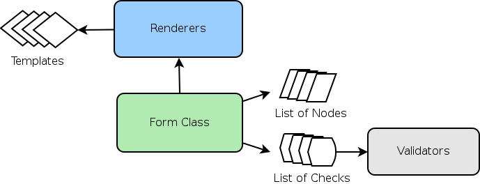

.. Yota documentation master file, created by
   sphinx-quickstart on Sun Apr 21 04:43:03 2013.
   You can adapt this file completely to your liking, but it should at least
   contain the root `toctree` directive.

Yota: A simple, flexible HTML form library.
===========================================

Yota is a Python form library that aims to make generation of web forms fast yet flexible. It is designed to work with AJAX submission/validation or conventional submission methods. If you're trying to do something simple Yota's default should be well equipped for your needs, however it is still configurable enough to let you do more complex actions, even ones it wasn't originally designed to handle. Yota attempts to allow several ways to do things when it makes sense, but tries at all costs to avoid syntax that is overly confusing or non-obvious.

Basic Features
==============

* Simple declarative syntax for defining a Form schema
* Add elements and validators to your Form dynamically, freeing you from the bounds of a static Form schema.
* Flexible validation structure that allows an arbitrary number of inputs as well as outputs.
* Validation framework is designed to return results via JSON for client side rendering or directly to the rendering context for display after page submission.
* AJAX validation methods support piecewise validation for instant user feedback or on submit validation.
* Small, tested and documented. Under 1,000 lines of code without tests and documentation.
* Many small callback hooks built in limiting the amount of monkey-patching required to allow more custom functionality.

Overall Architecture
====================

|  **Form**
|  The primary method of interaction with Yota, the Form class acts as a structure to contain all of the information about your Forms structure and configuration. Forms are usually just a collection of Nodes and Checks with some configuration data. Most method calls will be made on Form objects.

|  **Nodes**
|  Nodes are the actual bits that make up your form. By default a Node has a template attribute that the Renderer picks up in its rendering method as well as context information to be passed into the rendering template. Despite this default, a Node is very abstract, and could be implemented quite differently.  The Form class above it attempts to make a minimum of assumptions about the Nodes attributes.

|  **Checks**
|  Checks form the bridge between your submission data and your validators. Validators are supplied with the names of Nodes that are used in the actual Validation callable. At validation time these names are resolved to a tuple containing the actual Node reference as well as your submission data.

|  **Renderers**
|  Renderers provide a pluggable interface through which you can render your form. This allows interchange of different templating engines, etc.

Contents
========

.. toctree::
    Form.rst
    Nodes.rst
    Validators.rst

Indices and tables
==================

* :ref:`genindex`
* :ref:`modindex`
* :ref:`search`

